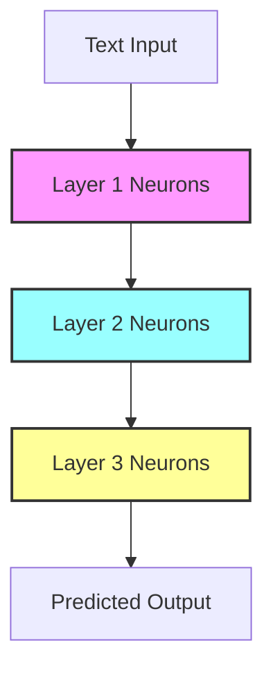

---
{"publish":true,"cssclasses":""}
---

## **1. Architecture vs Weights**

| Term             | Definition                                                                   | Analogy                                                                          |
| ---------------- | ---------------------------------------------------------------------------- | -------------------------------------------------------------------------------- |
| **Architecture** | Blueprint or design of the model; defines layers, connections, and data flow | Building blueprint: how floors and rooms connect                                 |
| **Weights**      | Learned numeric parameters controlling neuron influence                      | Volume knobs on each musician, sheet music telling them which notes to emphasize |
## **2. How They Work Together**



The **architecture** defines the structure of layers (e.g., Layer1 → Layer2 → Layer3), while **weights** are the numbers controlling the influence between neurons in each layer.

## **3. Open Weights Example**

```python
# Tiny illustrative snippet
layer1.weight = [
  [0.012, -0.054, 0.233, 0.001],
  [-0.112, 0.342, -0.431, 0.119],
  [0.003, -0.004, 0.002, -0.001]
]

layer1.bias = [0.001, -0.002, 0.003]
```

Real models have billions of weights (e.g., GPT-3 has 175B).
Weights encode learned patterns; architecture defines their interaction.

## **4. Fine-Tuning**

Manual weight adjustments are impossible due to the sheer size of models.

The fine-tuning process involves:
*   Providing examples (input/output pairs)
*   The model predicts an output
*   Calculating the error between predicted and actual output
*   Backpropagation automatically adjusts weights based on the error

Approaches to fine-tuning include:
*   **Full fine-tuning**: All weights are adjusted (requires high compute).
*   **Parameter-efficient fine-tuning (PEFT)**: Techniques like LoRA, adapters, and prefix-tuning adjust only a small subset of parameters.
*   **Prompt engineering**: Crafting better inputs to guide the model, without changing any weights.

## **5. Orchestra Analogy**

*   **Neurons** = individual musicians
*   **Layers** = sections of the orchestra (strings, brass, woodwinds)
*   **Weights** = volume knobs on each musician's instrument + the sheet music telling them which notes to emphasize
*   **Fine-tuning** = a conductor adjusting volume and emphasis for specific parts of a piece
*   **Prompt engineering** = giving the musicians better sheet music or clearer instructions instead of touching their individual knobs

Optimization algorithms (like Adam or SGD) automatically figure out which "knobs" to tweak during training.

## **6. Key Takeaways**

*   **Weights** and **architecture** are inseparable for a functional model.
*   **Open weights** allow for fine-tuning and adaptation, but full replication of a model's capabilities often requires its original training data.
*   **Fine-tuning** enables you to specialize huge pre-trained models for specific tasks without manually adjusting billions of parameters.